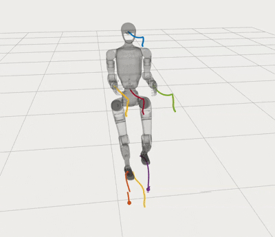

# Cost-Matching MPC for Humanoid Locomotion

This repo extends a whole-body humanoid MPC stack with a **cost-matching** pipeline: learn a parameter vector $\boldsymbol{\theta}$ (model/cost/penalty shaping) by matching an **offline MPC-side rollout value** $Q^{\mathrm{MPC}}_{\boldsymbol{\theta}}$ to **measured long-horizon returns** $Q^{\mathrm{meas}}$, while keeping the **constrained MPC structure** unchanged for deployment.

<div align="center">
  
  <p><b>Push the humanoid during locomotion</b></p>
</div>

---

## What’s inside

### 1 `humanoid_cost_matching_cpp` — Offline-Q replay engine (core)

**Purpose**
- Offline compute $Q^{\mathrm{MPC}}_{\boldsymbol{\theta}}$ over a rollout horizon $N$.
- Provide $\nabla_{\boldsymbol{\theta}} Q$ (and later optionally $\nabla_{\boldsymbol{x}} Q$, $\nabla_{\boldsymbol{u}} Q$).
- Keep a clean split between AD computation and runtime gating/parameter wiring.

**Status**
- All cost + penalty terms are implemented.
- AD penalties are re-implemented with `CondExp` for numerical consistency with OCS2 scalar penalties.
- Key integration pitfalls are fixed and standardized (const-correctness, CG value extraction, frame index includes, redefinition).

### 2 `humanoid_cost_matching` — Dataset + trainer + export/deploy (Python)

- Loads rollout `.npz` logs (state/input/mode + measured stage cost + refpack fields if present).
- Builds $Q^{\mathrm{meas}}$ using discounted returns.
- Calls `humanoid_cost_matching_offline_eval_py` to get $Q^{\mathrm{MPC}}_{\boldsymbol{\theta}}$ and $\frac{\partial Q}{\partial \boldsymbol{\theta}}$.
- Optimizes $\boldsymbol{\theta}$ (Adam) with **positivity constraint**: $\boldsymbol{\theta}=\mathrm{softplus}(\boldsymbol{r})+\varepsilon$.
- Exports `theta_latest.json` and deploys a `.info` file for the online MPC stack.

---

## Repo layout (high level)

- `humanoid_cost_matching_cpp/`
  - `include/.../offline/cost/tapes/` — CppAD models: $\mathrm{value}(\mathbf{xu},\mathbf{p})$, $\nabla_{\mathbf{xu}}\mathrm{value}(\mathbf{xu},\mathbf{p})$.
  - `include/.../offline/cost/terms/` — runtime gating + params + mapping to `value/grad`.
  - `include/.../offline/cost/penalties/barrier_penalties_ad.h` — AD barrier penalties (shared).
  - `src/.../offline/...` — implementations + `OfflineQEvaluator` + `CostBundle`.

- `humanoid_cost_matching/`
  - `data/` — `.npz` loading + batch building.
  - `train/` — training scripts + logs/ckpt.
  - `utils/export_theta_info.py` — deploy `.info` for MPC.
  - `humanoid_cost_matching_offline_eval_py` — Python bindings to C++ evaluator.

---

## Core design rules

### A) Naming convention

New offline cost components must follow:
- `include/.../offline/cost/tapes/penalty_xxx_tapes.h`
- `src/.../offline/cost/tapes/penalty_xxx_tapes.cpp`
- `include/.../offline/cost/terms/penalty_xxx_terms.h`

### B) Tape vs Term responsibilities

**Tape**
- Only builds AD model: $\mathrm{value}(\mathbf{xu},\mathbf{p})$, $\nabla_{\mathbf{xu}}\mathrm{value}(\mathbf{xu},\mathbf{p})$ (optionally $\nabla_{\boldsymbol{\theta}}\mathrm{value}$).

**Term (ICostTerm)**
- Runtime gating via `refMgr_->getContactFlags(t)`.
- Assemble $(\mathbf{x},\mathbf{u})\mapsto \mathbf{xu}$ and params $\mathbf{p}$.
- Map tape outputs to $\mathrm{value}$, $\nabla_{\mathbf{x}}$, and $\nabla_{\boldsymbol{\theta}}$.

### C) CostBundle policy

- **No `TerminalSumTerm`.**
- Terminal is accumulated the same way as stage inside `CostBundle`.

### D) Tape resource ownership

Offline evaluator stores Pinocchio/robot model AD as **const pointers**.
If a tape needs non-const APIs, do **not** `const_cast` in the evaluator.

**Required pattern (inside tape)**
- copy Pinocchio AD **by value**.
- clone robot model into a **writable** `unique_ptr`.

---

## Training

The current trainer minimizes a simple value-matching objective:

- For sampled indices $k$ from logged rollouts:
  - $Q^{\mathrm{meas}}_k$ = discounted return from measured stage costs.
  - $Q^{\mathrm{MPC}}_{\boldsymbol{\theta},k}$ and $\frac{\partial Q}{\partial \boldsymbol{\theta}}$ from `OfflineQEvaluator` using rollout horizon $N$.

**Loss**
$
\mathcal{L}(\boldsymbol{\theta})
= \mathbb{E}\left[\left(Q^{\mathrm{MPC}}_{\boldsymbol{\theta}}-Q^{\mathrm{meas}}\right)^2\right]
$

**Update**
- Adam on raw parameters $\boldsymbol{r}$, with:
$
\boldsymbol{\theta}=\mathrm{softplus}(\boldsymbol{r})+\varepsilon
$

**Theta layout**
Must match C++ `ThetaLayout`. Current python layout:
- $\theta = [\mathrm{dyn}(6),\, Q(n_x),\, R(n_u),\, Q_f(n_x),\, \mathrm{base}(12),\, \mathrm{com}(2),\, \mathrm{swing}(24),\, \mathrm{torque}(12)]$

**Cost-rate note**
If `measured_stage_cost` is a cost-rate, the script multiplies by $\Delta t$ (toggleable via flags in the script).

---

## Running training (minimal)

Prepare `.npz` logs (typical keys):
- `time` $(T,)$
- `state` $(T,n_x)$
- `input` $(T,n_u)$
- `mode` $(T,)$
- a measured stage-cost key expected by `load_measured_stage_cost()`.

Run:
```bash
python3 humanoid_cost_matching/train/train_cost_matching.py \
  --task /wb_humanoid_mpc_ws/src/wb_humanoid_mpc/robot_models/unitree_g1/g1_centroidal_mpc/config/mpc/task_cost_matching.info \
  --urdf /wb_humanoid_mpc_ws/src/wb_humanoid_mpc/robot_models/unitree_g1/g1_description/urdf/g1_29dof.urdf \
  --ref  /wb_humanoid_mpc_ws/src/wb_humanoid_mpc/robot_models/unitree_g1/g1_centroidal_mpc/config/command/reference.info \
  --npz  /wb_humanoid_mpc_ws/src/wb_humanoid_mpc/humanoid_cost_matching/logs/obs_data \
  --gamma 0.985 --dt 0.02 --N 60 \
  --iters 2000 --batch 64 --lr 1e-3
````

Outputs:

* `humanoid_cost_matching/logs/cm_runs/<run_id>/train_log*.csv`
* `humanoid_cost_matching/logs/cm_runs/<run_id>/ckpt_step_*.json`
* `humanoid_cost_matching/logs/cm_runs/<run_id>/theta_latest.json`
* deployed theta artifacts:

  * `humanoid_cost_matching/logs/deployed_theta/` (+ history)

## Acknowledgements
This project is built upon the foundational work of several open-source libraries and repositories. I would especially like to acknowledge:
- [wb_humanoid_mpc](https://github.com/manumerous/wb_humanoid_mpc): the core centroidal dynamics MPC framework used in this project. The Cost-Matching implementation and training pipeline described here are the original contributions of this repository, built on top of this excellent base.
- [ocs2](https://github.com/leggedrobotics/ocs2)
- [pinocchio](https://github.com/stack-of-tasks/pinocchio)
- [hpipm](https://github.com/giaf/hpipm)